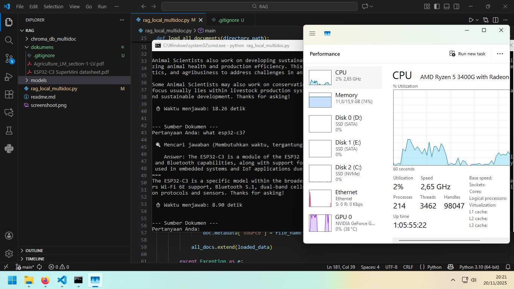

##### With GPU Need NVIDIA CUDA Toolkit
```bash
set CMAKE_ARGS=-DGGML_CUDA=on
pip install llama-cpp-python
```
##### Without GPU
```bash
pip install llama-cpp-python
```
```bash
pip install langchain
pip install langchain_community langchain-core
pip install langchain_classic langchain_text_splitters langchain_huggingface langchain_chroma pypdf docx2txt
```
